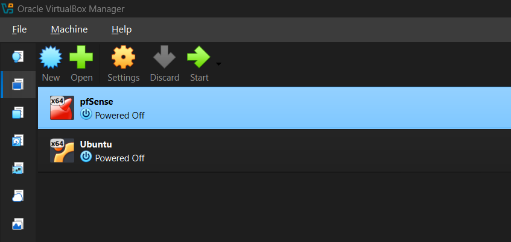

# Progress Log

## 30 June 2026

- Started actual homelab setup. Originally planned to start with pfSense, Kali, and Ubuntu together, but decided to start with just pfSense and Ubuntu first to get the base network working before introducing Kali as the attack machine later.

- Initially planned to use Ubuntu 26.04, but switched to 24.04 LTS instead after realising 26.04's RAM requirements were too high to run comfortably alongside pfSense and Kali on this machine.

    - 24.04 isn't drastically lighter, but should be more manageable. If it still runs slow, I'll explore lighter Ubuntu variants.

- Created the pfSense VM in VirtualBox (1GB RAM, 2 CPUs, 16GB storage).

- Created the Ubuntu VM in VirtualBox (4GB RAM, 2 CPUs, 25GB storage).

- Took a screenshot of both VMs listed in VirtualBox as a record of today's progress.

 

*Figure 1: Initial deployment of pfSense and Ubuntu virtual machines.*

### Next Steps
- Network configuration (WAN/LAN adapters, IP addressing, routing between machines) intentionally left for a later session. Today was just about getting both VMs created and installed.