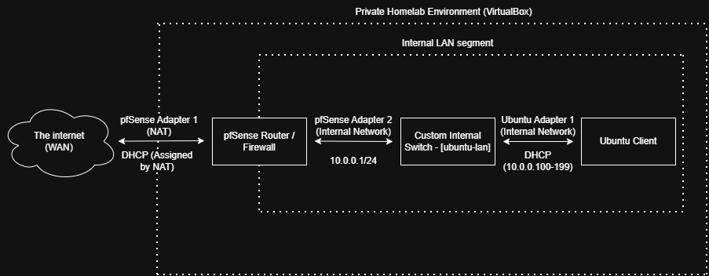
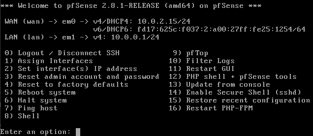
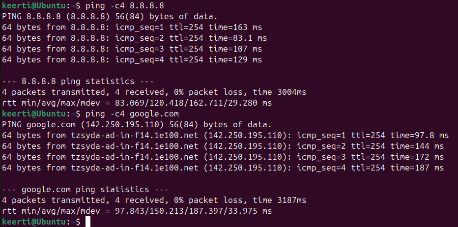

# Progress Log

## 30 June 2026

- Started actual homelab setup. Originally planned to start with pfSense, Kali, and Ubuntu together, but decided to start with just pfSense and Ubuntu first to get the base network working before introducing Kali as the attack machine later.

- Initially planned to use Ubuntu 26.04, but switched to 24.04 LTS instead after realising 26.04's RAM requirements were too high to run comfortably alongside pfSense and Kali on this machine.

    - 24.04 isn't drastically lighter, but should be more manageable. If it still runs slow, I'll explore lighter Ubuntu variants.

- Created the pfSense VM in VirtualBox (1GB RAM, 2 CPUs, 16GB storage).

- Created the Ubuntu VM in VirtualBox (4GB RAM, 2 CPUs, 25GB storage).

- Took a screenshot of both VMs listed in VirtualBox as a record of today's progress.

<br>


<br>
*Figure 1: Initial deployment of pfSense and Ubuntu virtual machines.*

## 2 July 2026

- Drew up a network topology diagram using draw.io to plan the homelab network before touching any settings, always better to design first and configure second.

- pfSense VM settings updated before installation:
  - Boot order changed to Hard Disk first, Optical second, Floppy removed
  - USB controller disabled
  - Adapter 1 confirmed as NAT (WAN)
  - Adapter 2 enabled as Internal Network, named `ubuntu-lan` (LAN)

- Installed pfSense 2.8.1

- During installation, configured interfaces:
  - WAN: em0, DHCP via VirtualBox NAT
  - LAN: em1, static IP `10.0.0.1/24`, DHCP pool `10.0.0.100-10.0.0.199`

- Avoided `192.168.1.x` for the LAN subnet as it's too common and risks conflicting with home router ranges. Went with `10.0.0.0/24` instead.

- Verified pfSense console showed correct interface assignment and IP configuration after boot.

- Ubuntu VM network adapter changed to Internal Network / `ubuntu-lan` in preparation for connectivity testing. VM not booted yet.

- Snapshot taken of pfSense VM post-install as a restore point before any further configuration.

### Screenshots


<br>
*Figure 2: Initial diagram of the current network topology.*

<br>


<br>
*Figure 3: pfSense console confirming LAN interface assigned to em1 at 10.0.0.1/24*

### Notes & Resources Used
- Referenced [David Varghese's homelab blog series](https://blog.davidvarghese.dev/posts/building-home-lab-part-2/) for pfSense VM configuration and installation steps.

## 5 July 2026

- Booted pfSense and Ubuntu together for the first time to test network connectivity.

- Verified that Ubuntu successfully received a DHCP address from pfSense (10.0.0.XXX/24) on the ubuntu-lan internal network.

- Confirmed default gateway pointing to pfSense (10.0.0.1) via `ip route`. Output shown below:

```
default via 10.0.0.1 dev enp0s3 proto dhcp src 10.0.0.XXX metric 100
10.0.0.0/24 dev enp0s3 proto kernel scope link src 10.0.0.XXX metric 100
```

- Accessed pfSense web GUI from Ubuntu's browser at 10.0.0.1 and 
completed the setup wizard
- Notable configurations:
  - Configured hostname and domain for the local network
  - DNS: 8.8.8.8 / 8.8.4.4 with forwarding mode enabled, override setting off so these DNS servers will be used no matter what
  - Timezone: Pacific/Auckland
  - Changed admin password from default

- Noticed `Block bogon networks` was still enabled on the WAN interface after completing the wizard.
  - This needed to be unchecked because VirtualBox NAT assigns a private IP to the WAN interface, and bogon blocking can interfere with that
  - This setting is only appropriate when WAN is a real public-facing interface, which in this case, it is not.
  - I correctly unchecked `Block private networks` the first time going through the wizard.

- Confirmed full internet connectivity with 0% packet loss pinging both 8.8.8.8 and google.com from the Ubuntu VM, confirming DNS resolution is also working.

- Snapshots taken of both VMs at this confirmed working state as restore points.

<br>


<br>
*Figure 4: Successful ping to 8.8.8.8 and google.com confirming internet connectivity through pfSense.*

### Notes & Resources Used
- Referenced official Netgate pfSense setup wizard documentation

### Next Steps
- Add Kali Linux as attack machine and configure third network adapter
- Begin active security exercises